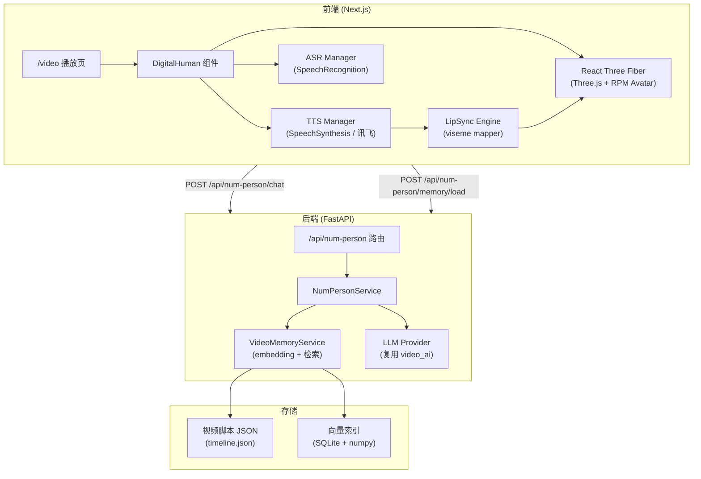
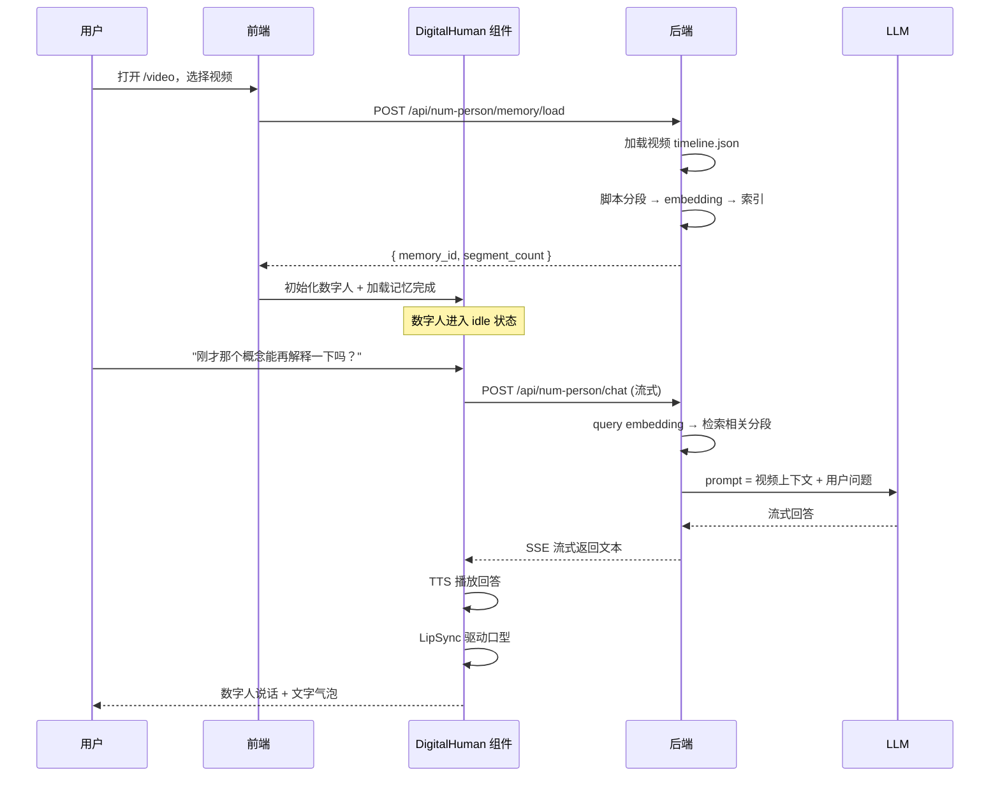
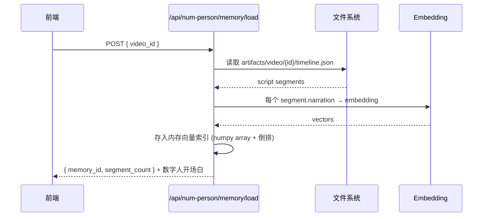

# numPerson — 数字人播报与交互系统

> 版本：v1.0.0 · 2026-05-27
> 文档状态：设计讨论中，待确认后进入可开发基线
> 适用范围：`/video` 视频播放页数字人伴读、后端数字人对话 API
> 对齐文档：
> - `Dorc/video.md`
> - `Dorc/video_v5.md`
> - `Dorc/Frontend-Design-Doc.md`
> - `Dorc/后端设计文档.md`

---

## 1. 文档目的

本文档设计 SparkLearn 的数字人播报与交互系统。核心目标是在视频播放页引入一个 3D 数字人形象，实现：

1. **语音播报同步**：数字人口型与 TTS 语音实时对应
2. **视频内容记忆**：数字人"记住"当前视频的脚本内容，能围绕视频内容回答用户问题
3. **自然交互**：用户可与数字人自由对话，提问视频知识点
4. **沉浸式 UI**：视频播放窗口 + 数字人并排布局，暗色直播间风格背景

---

## 2. 项目背景与业务价值

### 2.1 背景

SparkLearn 已具备视频生成与播放能力（见 `video.md` ~ `video_v5.md`）。当前视频播放页为传统播放器 + 下载工具栏，缺少"陪伴感"和"互动感"。

引入数字人可实现：
- **伴读场景**：数字人"陪伴"学习者观看视频，可随时解答疑问
- **内容检索**：用户不用回看整个视频，直接问数字人"刚才那个概念是什么意思"
- **学习陪伴**：类似 AI 学伴（已有 Agent Pet），但升级为 3D 形象 + 语音对话

### 2.2 业务价值

| 价值点 | 说明 |
|--------|------|
| 学习沉浸感 | 3D 数字人 + 语音对话，比纯文字聊天更自然 |
| 内容可检索 | RAG 驱动，数字人精准回答视频相关问题 |
| 跨平台 | 前端 WebGL 渲染，桌面/移动端均可运行 |
| 可扩展 | Avatar 可替换（Ready Player Me 生态），对话能力可升级 |

---

## 3. 现有文档规范提取与统一格式

沿用 `video.md` 第 3 节的统一文档格式：

1. 一级章节使用 `## n. 标题`
2. 设计约束使用表格表达
3. 接口契约使用"方法 + 路径 + 请求体 + 响应体 + 错误码"模板
4. 流式接口统一使用 SSE envelope
5. 上线、测试、验收使用 Checklist
6. 所有密钥以环境变量占位，不写入真实值

工程规范对齐：

| 类别 | 统一规范 |
|------|----------|
| 代码风格 | 前端 TypeScript + React Hooks + 原生 `fetch` 封装；后端 FastAPI + Pydantic |
| 目录组织 | 数字人组件集中在 `frontend/src/components/digital-human/`；后端 API 在 `backend/app/routes/num_person.py` |
| 分支命名 | `feature/num-person` |
| 提交信息 | `feat(num-person): add 3D avatar rendering with Three.js` |
| API 文档模板 | 每个接口必须列出请求字段、响应字段、状态码、业务错误码 |
| 版本号规则 | 本文档基线 `v1.0.0`，后续迭代递增 |

---

## 4. 系统目标与范围

### 4.1 系统目标

1. 在 `/video` 页面右侧渲染 3D 数字人形象（Ready Player Me + Three.js）
2. 数字人口型与 TTS 语音实时同步
3. 数字人加载当前视频的脚本内容作为"记忆"
4. 用户可通过文本/语音与数字人对话，数字人基于视频内容 + LLM 回答
5. 视频播放窗口按比例缩放，与数字人区域自适应并排
6. 暗色渐变 + 粒子动效背景，强化沉浸式 UX

### 4.2 范围边界

| 范围 | 本期策略 |
|------|----------|
| 数字人渲染 | Ready Player Me GLB 模型 + Three.js WebGL 渲染，前端纯客户端 |
| 语音合成 (TTS) | 浏览器 SpeechSynthesis API 作为默认；保留升级到讯飞 TTS 的接口 |
| 语音识别 (ASR) | 浏览器 SpeechRecognition API（Web Speech API）；保留升级到讯飞语音听写的接口 |
| 口型同步 | 基于 TTS 音频振幅 + 预定义 viseme 映射表驱动 morph targets |
| 对话记忆 | 后端 RAG：视频脚本分段 → embedding → 向量检索 + LLM 回答 |
| 对话前端 | 文字输入框 + 语音输入按钮 + 对话气泡叠加层 |
| 背景 | CSS 暗色渐变 + Canvas 粒子动效（纯前端，无外部依赖） |
| 移动端 | 数字人降级为静态头像 + 语音波形；3D 渲染仅在桌面端开启 |

---

## 5. 技术选型与版本锁定

### 5.1 新增前端依赖

| 项 | 版本 | 用途 |
|----|------|------|
| three | `^0.170.0` | 3D 渲染引擎，加载 GLB 模型、管理场景/相机/光照 |
| @react-three/fiber | `^9.0` | Three.js 的 React 声明式封装（可选，降低集成复杂度） |
| @react-three/drei | `^10.0` | fiber 配套工具（OrbitControls 禁用、Environment 预设等） |

### 5.2 新增后端依赖

| 项 | 版本 | 用途 |
|----|------|------|
| openai | `^1.50.0` | LLM 调用（兼容 OpenAI API 格式，复用现有 video_ai.py 的 provider） |
| numpy | `^1.26` | embedding 向量计算辅助 |

### 5.3 第三方服务

| 服务 | 方案 | 说明 |
|------|------|------|
| 3D 形象 | Ready Player Me | 通过 URL `https://models.readyplayer.me/{avatarId}.glb` 获取 GLB 模型，免费额度充足 |
| TTS 默认 | Web Speech API (`SpeechSynthesis`) | 浏览器内置，零成本，无需后端；中文语音可用 `zh-CN` |
| TTS 升级 | 讯飞 TTS（已集成） | 高质量语音，需后端签名；前端通过 `/api/tts/synthesize` 获取音频 |
| ASR 默认 | Web Speech API (`SpeechRecognition`) | Chrome/Edge 支持良好，中文识别可用 |
| LLM 对话 | 复用现有 video_ai.py provider（qwen-plus / 讯飞星火） | 与视频生成共享 AI 配置 |
| Embedding | 复用现有 OpenAI 兼容 API | 对视频脚本做向量化 |

---

## 6. 总体架构

### 6.1 分层架构图



### 6.2 运行时时序



### 6.3 前端模块边界

```
frontend/src/
├── app/(shell)/
│   └── video/page.tsx                    # 改造：视频 + 数字人并排布局
├── components/digital-human/
│   ├── DigitalHumanStage.tsx             # 主容器：管理 TTS/ASR/LipSync 状态机
│   ├── DigitalHumanScene.tsx             # Three.js 场景：RPM avatar 加载、光照、背景粒子
│   ├── DigitalHumanChat.tsx              # 对话气泡叠加层
│   ├── DigitalHumanControlBar.tsx        # 底部控制：文字输入框、语音按钮、静音
│   ├── hooks/
│   │   ├── useDigitalHuman.ts            # 数字人核心状态 hook
│   │   ├── useTTS.ts                     # TTS 抽象层（SpeechSynthesis / 讯飞切换）
│   │   ├── useASR.ts                     # ASR 抽象层（SpeechRecognition）
│   │   ├── useLipSync.ts                 # 音频振幅 → viseme 映射
│   │   └── useParticleBackground.ts      # Canvas 粒子背景 hook
│   └── workers/
│       └── lip-sync.worker.ts            # Web Worker：音频分析（OfflineAudioContext）
└── lib/
    ├── api/num-person.ts                 # 数字人 API adapter
    └── api/types.ts                      # 新增 DigitalHuman 类型
```

### 6.4 后端模块边界

```
backend/app/
├── routes/
│   └── num_person.py                     # API 路由
├── schemas/
│   └── num_person.py                     # Pydantic 请求/响应模型
├── services/
│   ├── num_person_service.py             # 对话编排
│   └── video_memory_service.py           # 脚本分段、embedding、检索
└── storage/
    └── video_memory_repo.py              # 向量索引持久化（SQLite + JSON）
```

---

## 7. Ready Player Me + Three.js 集成方案

### 7.1 Avatar 获取

Ready Player Me 提供标准化 3D 头像：

```text
模型 URL 格式: https://models.readyplayer.me/{avatarId}.glb
```

**获取方式：**

1. 在 `https://readyplayer.me` 创建 avatar，复制 avatarId
2. 或使用 RPM 的 Quick Start 链接（无需登录）：`https://readyplayer.me/avatar?={avatarId}`
3. 系统预设 3-5 个 avatar ID 供用户选择，存储在前端配置中
4. GLB 文件包含完整的骨骼绑定 + morph targets（含 15 个 Oculus Visemes）

**预设 Avatar 配置：**

```typescript
// frontend/src/components/digital-human/avatar-presets.ts
export const AVATAR_PRESETS = [
  { id: '64c8f8e5a1b2c3d4e5f6a7b8', name: '小智', gender: 'male', style: 'casual' },
  { id: '74c8f8e5a1b2c3d4e5f6a7b9', name: '小慧', gender: 'female', style: 'business' },
  { id: '84c8f8e5a1b2c3d4e5f6a7c0', name: '小星', gender: 'neutral', style: 'tech' },
]
```

### 7.2 Three.js 场景结构

```
Scene
├── AmbientLight (环境光，强度 0.4)
├── DirectionalLight (主光源，强度 1.2，位置 [2, 3, 4])
├── RimLight (轮廓光，强度 0.6，位置 [-1, 1, -2])
├── AvatarGroup
│   └── GLB Model (来自 Ready Player Me)
│       ├── Mesh: Head (含 viseme morph targets)
│       ├── Mesh: Body
│       ├── Mesh: Eyes (含 blink morph targets)
│       └── Skeleton (骨骼动画)
├── ParticleField (Canvas 2D 粒子背景，独立于 Three.js scene)
└── Camera (PerspectiveCamera, fov=45, position=[0, 1.6, 2.8])
```

### 7.3 Morph Targets — Viseme 映射

Ready Player Me GLB 模型包含 15 个 Oculus Visemes：

| Viseme Index | Morph Target Name | 音素示例 |
|--------------|-------------------|----------|
| 0 | `viseme_sil` | 静音 |
| 1 | `viseme_PP` | /p/, /b/, /m/ |
| 2 | `viseme_FF` | /f/, /v/ |
| 3 | `viseme_TH` | /θ/, /ð/ |
| 4 | `viseme_DD` | /t/, /d/ |
| 5 | `viseme_kk` | /k/, /g/ |
| 6 | `viseme_CH` | /tʃ/, /dʒ/ |
| 7 | `viseme_SS` | /s/, /z/ |
| 8 | `viseme_nn` | /n/, /l/ |
| 9 | `viseme_RR` | /r/ |
| 10 | `viseme_aa` | /ɑː/, /a/ |
| 11 | `viseme_E` | /e/, /ɛ/ |
| 12 | `viseme_I` | /i/, /ɪ/ |
| 13 | `viseme_O` | /o/, /ɔ/ |
| 14 | `viseme_U` | /u/, /ʊ/ |

### 7.4 Idle 动画

数字人无对话时循环以下状态：

| 状态 | 持续 | 表现 |
|------|------|------|
| `breathing` | 持续 | 身体微微起伏（y 轴 ±0.02 正弦位移） |
| `blink` | 每 3-5 秒随机 | 眼部 blink morph target 快速 0→1→0（200ms） |
| `glance` | 每 8-15 秒随机 | 头部 y 轴缓慢旋转 ±5° |
| `listening` | 用户说话时 | 头部微倾 3°，眼睛睁大 |
| `speaking` | TTS 播放中 | 口型 viseme 实时驱动 + 头部自然摆动 |
| `thinking` | 等待 LLM 响应 | 眼睛向上看 + 手部微微敲击 |

---

## 8. TTS 与口型同步策略

### 8.1 TTS 抽象层

前端通过 `useTTS` hook 统一 TTS 调用，支持双 provider 切换：

```typescript
// TTS Provider 接口
interface TTSProvider {
  speak(text: string, options: TTSOptions): Promise<void>
  stop(): void
  onEvent(event: TTSEvent, callback: Function): void
}

// 默认：Web Speech API - SpeechSynthesis
class BrowserTTSProvider implements TTSProvider { ... }

// 升级：讯飞 TTS（通过后端代理）
class XunfeiTTSProvider implements TTSProvider { ... }
```

**TTS Provider 切换逻辑：**
- 开发/低延迟场景：`BrowserTTSProvider`（SpeechSynthesis，零延迟）
- 高质量场景：`XunfeiTTSProvider`（需后端，音质好，支持更多声线）
- 默认使用浏览器 TTS；设置面板可切换

### 8.2 口型同步 (LipSync) 策略

采用**音频振幅驱动**方案（无需音素识别，降低算力要求）：

```text
TTS Audio → AnalyserNode (FFT) → RMS Amplitude → Viseme Intensity → Morph Target Weight
```

**工作流程：**

1. TTS 开始时，创建 `AudioContext` + `AnalyserNode`
2. 每 50ms（20fps）执行 FFT 分析，提取 RMS 振幅
3. RMS 值映射为"说话强度"（0~1）
4. 说话强度驱动 viseme 权重：
   - `strength > 0.1`：口型在 `viseme_aa` (张嘴) 和 `viseme_I` (微笑) 之间插值
   - `strength < 0.1`：缓慢回到 `viseme_sil` (闭嘴)
5. 在 Web Worker 中执行，避免阻塞主线程渲染

**技术说明：**
- 这是简化方案。升级方案（V2）可接入 rhubarb-lip-sync 或 Azure Speech SDK 的 viseme 事件，实现更精准的音素级口型
- 浏览器 TTS 的 `onboundary` 事件可提供字/词级别的时间点，用于辅助同步

### 8.3 ASR 语音输入

```typescript
// 浏览器 SpeechRecognition API
const recognition = new (window.SpeechRecognition || window.webkitSpeechRecognition)()
recognition.lang = 'zh-CN'
recognition.interimResults = false
recognition.continuous = false
```

- 用户点击麦克风按钮 → 开始收音 → 识别结果填入输入框 → 自动发送
- 降级：麦克风按钮始终可用，点击后展示输入框（用户手动输入）

---

## 9. 对话记忆系统

### 9.1 记忆结构

数字人加载当前视频的脚本内容作为"短期记忆"，以分段为单位：

```json
{
  "memory_id": "mem_video_001",
  "video_id": "video_001",
  "segments": [
    {
      "segment_id": "seg_001",
      "title": "变量是什么",
      "narration": "变量可以理解为数据的名字...",
      "start_ms": 0,
      "end_ms": 12400,
      "embedding": [0.012, 0.034, ...]
    }
  ],
  "created_at": "2026-05-27T12:00:00+08:00"
}
```

### 9.2 记忆加载流程



### 9.3 对话流程 (RAG)

```text
用户提问 "变量的作用域是什么？"
  → query embedding
  → 余弦相似度检索 top-3 相关 segments
  → 构建 LLM prompt:
      "你是一位AI学习伴侣。根据以下视频内容回答用户问题。
       相关视频片段：
       1. [{seg_003}] 变量的作用域...
       2. [{seg_007}] 全局变量vs局部变量...
       如果视频内容没有覆盖到用户的问题，请诚实说明。
       用户问题：变量的作用域是什么？"
  → LLM 流式返回
  → 前端 TTS 播报 + 口型同步
```

### 9.4 记忆生命周期

| 事件 | 行为 |
|------|------|
| 用户选择视频 | `POST /memory/load`，建立 memory |
| 用户切换视频 | 清除旧 memory，加载新视频 memory |
| 用户关闭页面 | 10 分钟后自动清除 memory（可配置） |
| 同一视频多次打开 | 复用缓存的 embedding（带 `video_id` + `updated_at` 校验） |

---

## 10. 前端 UI/UX 设计

### 10.1 整体布局

```
┌──────────────────────────────────────────────────────────────────┐
│  Topbar (现有)                                                     │
├────────┬──────────────────────────────┬───────────────────────────┤
│ Video  │                              │  ┌─────────────────────┐  │
│ List   │      Video Player            │  │   Digital Human     │  │
│        │      (自适应缩放)              │  │   3D Avatar         │  │
│ 160px  │      aspect-ratio: 16/9      │  │   360px × 540px     │  │
│        │      max-width: 自适应        │  │                     │  │
│        │                              │  │   [粒子光晕背景]     │  │
│        │                              │  └─────────────────────┘  │
│        │                              │  ┌─────────────────────┐  │
│        │                              │  │  Chat Bubble        │  │
│        │      Video Info + Controls   │  │  "有什么问题可以问我" │  │
│        │                              │  └─────────────────────┘  │
│        │                              │  [🎤语音] [📝输入框] [发送] │
└────────┴──────────────────────────────┴───────────────────────────┘
```

**布局规则：**

1. **三栏布局**：Video List (160px) | Video Player (flex-1) | Digital Human (360px)
2. **视频自适应**：Player 区域使用 `aspect-ratio: 16/9` + `max-width: calc(100vw - 160px - 360px - padding)`
3. **小屏幕 (< 1024px)**：数字人区域折叠成一个圆形头像按钮，点击展开为全屏 overlay
4. **背景**：主内容区使用暗色渐变 `linear-gradient(135deg, #0f0f1a 0%, #1a1a2e 50%, #16213e 100%)` + Canvas 粒子

### 10.2 数字人区域详细设计

```
┌─────────────────────────┐
│                         │
│     ┌───────────┐       │
│     │           │       │  360px × 540px
│     │  3D Avatar│       │  圆角 20px
│     │  (Three.js│       │  玻璃态卡片
│     │   Canvas) │       │  bg: rgba(255,255,255,0.04)
│     │           │       │  backdrop-filter: blur(20px)
│     │           │       │  border: 1px rgba(255,255,255,0.08)
│     └───────────┘       │
│                         │
│  状态指示器              │
│  ● 在线 · 已学习当前视频  │
│                         │
│  ┌─────────────────┐    │
│  │ 对话气泡           │    │
│  │ "有什么问题问我"    │    │
│  └─────────────────┘    │
│                         │
│  ┌─────────────────┐    │
│  │ 输入你想问的...  🎤 │    │
│  └─────────────────┘    │
└─────────────────────────┘
```

### 10.3 页面状态

| 状态 | 数字人表现 | 用户可操作 |
|------|-----------|-----------|
| `idle` | 呼吸 + 眨眼 idle 动画，偶尔 glance | 选视频、点击数字人打招呼 |
| `loading_memory` | 眼睛闪烁"思考"动画 | 等待 |
| `ready` | 微笑 + 挥手打招呼，播报开场白（TTS） | 文字/语音提问 |
| `listening` | 头部微倾，眼睛注视用户 | 说话中，展示语音波形 |
| `thinking` | 眼睛向上看 + 手部微动 | 等待中，展示 typing 动画 |
| `speaking` | 口型同步 + 自然手势 | 可打断（点击暂停按钮） |
| `error` | 挠头 + 脸红 | 重试、切换到文字模式 |

### 10.4 背景设计

**暗色渐变底：**

```css
background: linear-gradient(135deg, #0f0f1a 0%, #1a1a2e 50%, #16213e 100%);
```

**粒子动效（Canvas 2D）：**
- 200 个半透明粒子（直径 1-3px）
- 缓慢上浮 + 随机水平漂移
- 颜色：`#4fc3f7`(蓝) 30% + `#7c4dff`(紫) 30% + `#ffffff`(白) 40%
- 透明度：0.1-0.3
- 粒子在数字人区域后方形成微弱的"光晕"聚集效果
- 独立于 Three.js 的 Canvas，覆盖在背景层上

**数字人容器玻璃态：**
```css
.digital-human-card {
  background: rgba(255, 255, 255, 0.04);
  backdrop-filter: blur(20px);
  border: 1px solid rgba(255, 255, 255, 0.08);
  border-radius: 20px;
  box-shadow: 0 8px 32px rgba(0, 0, 0, 0.3);
}
```

### 10.5 交互流程

1. 用户进入 `/video` → 暗色背景 + 粒子动效渲染
2. 数字人位置展示加载动画（旋转光环）
3. Avatar GLB 加载完成 → 进入 `idle` 状态（呼吸 + 眨眼）
4. 用户选择视频 → 后端加载视频记忆 → 数字人播报开场白："你好，我已经学习完了《xxx》这个视频，有什么问题可以问我"
5. 用户提问方式：
   - **文字**：底部输入框输入 → Enter 发送
   - **语音**：点击麦克风按钮 → 开始收音 → 自动转文字发送
6. 数字人进入 `thinking` → `speaking`：口型同步播报回答 + 对话气泡展示文字
7. 回答完毕 → 回到 `ready` 状态，等待下一轮提问

---

## 11. 接口契约

### 11.1 统一响应格式

沿用 `video.md` 第 9.1 节格式：

```json
{
  "success": true,
  "data": {},
  "error": null,
  "request_id": "req_20260527_xxxx"
}
```

流式接口使用 SSE envelope：

```text
data: {"type":"token","payload":{"text":"变量"}}

data: {"type":"done","payload":{"total_tokens":156}}
```

### 11.2 `POST /api/num-person/memory/load`

用途：为指定视频建立数字人记忆。

请求体：

```json
{
  "video_id": "video_001",
  "user_id": "single_user"
}
```

响应体：

```json
{
  "success": true,
  "data": {
    "memory_id": "mem_video_001_20260527",
    "video_title": "Python 变量：给数据贴上清晰标签",
    "segment_count": 8,
    "greeting": "你好！我已经学习完了《Python 变量》这个视频，一共8个知识点。有什么想深入了解的，尽管问我！"
  },
  "error": null,
  "request_id": "req_xxx"
}
```

超时：`5000ms`（含 embedding 计算）。
重试：网络错误可重试 1 次。

### 11.3 `POST /api/num-person/chat`

用途：与数字人对话（流式 SSE）。

请求体：

```json
{
  "memory_id": "mem_video_001_20260527",
  "message": "变量的作用域是什么意思？",
  "user_id": "single_user",
  "history": [
    { "role": "user", "content": "什么是变量" },
    { "role": "assistant", "content": "变量可以理解为数据的标签..." }
  ]
}
```

SSE 事件类型：

| type | payload | 说明 |
|------|---------|------|
| `token` | `{ "text": "变量" }` | LLM 流式 token |
| `retrieved` | `{ "segments": [{ "segment_id": "seg_003", "title": "变量作用域", "score": 0.92 }] }` | 检索到的相关分段（调试用，生产可省略） |
| `error` | `{ "code": "MEMORY_NOT_FOUND", "message": "记忆已过期，请重新选择视频" }` | 错误 |
| `done` | `{ "total_tokens": 156 }` | 完成 |

超时：`30000ms`（LLM 流式生成）。
心跳：`15000ms` 无 token 则发送 `heartbeat`。

### 11.4 `DELETE /api/num-person/memory/{memory_id}`

用途：清除数字人记忆（页面关闭时调用）。

响应体：

```json
{
  "success": true,
  "data": { "cleared": true },
  "error": null,
  "request_id": "req_xxx"
}
```

### 11.5 `GET /api/num-person/memory/{memory_id}`

用途：查询记忆状态（用于断线重连恢复）。

响应体：

```json
{
  "success": true,
  "data": {
    "memory_id": "mem_video_001_20260527",
    "video_id": "video_001",
    "video_title": "Python 变量：给数据贴上清晰标签",
    "segment_count": 8,
    "created_at": "2026-05-27T12:00:00+08:00",
    "ttl_sec": 600
  },
  "error": null,
  "request_id": "req_xxx"
}
```

### 11.6 状态码与业务错误码

沿用 `video.md` 第 9.7、9.8 节格式，新增：

| 错误码 | 场景 | 重试 |
|--------|------|------|
| `NP_MEMORY_NOT_FOUND` | memory_id 不存在或已过期 | 否，前端重新 load |
| `NP_EMBED_FAILED` | embedding 计算失败 | 是 |
| `NP_RETRIEVE_FAILED` | 向量检索失败 | 是 |
| `NP_LLM_FAILED` | LLM 回答生成失败 | 是 |
| `NP_VIDEO_NO_SCRIPT` | 视频无脚本内容 | 否 |
| `NP_QUOTA_EXCEEDED` | LLM 配额超限 | 是，延迟重试 |

---

## 12. 异常处理与降级方案

### 12.1 Avatar 加载失败

1. Three.js GLB 加载超时（10s）→ 展示预设 SVG 静态头像（复用 PetAvatar 组件）
2. WebGL 不可用（移动端/老旧浏览器）→ 降级为静态头像 + CSS 呼吸动画
3. Ready Player Me CDN 不可用 → 展示本地 fallback 头像

### 12.2 TTS 失败

1. SpeechSynthesis 不可用 → 仅展示文字气泡，不播报语音
2. 讯飞 TTS 鉴权/网络失败 → 自动降级到 SpeechSynthesis
3. TTS 中断 → 口型回归 idle，气泡保留文字

### 12.3 ASR 失败

1. SpeechRecognition 不可用 → 隐藏麦克风按钮，仅文字输入
2. 识别置信度 < 0.5 → 展示"未听清，请重试"
3. 连续 3 次识别失败 → 自动切换到文字输入模式

### 12.4 对话记忆失败

1. embedding 失败 → 降级为纯 LLM 对话（不带视频上下文），数字人提示"暂时记不起视频内容，但我会尽力回答"
2. 检索无结果 → LLM 基于对话历史尽力回答
3. memory 过期 → 自动重新 load

### 12.5 性能降级

| 场景 | 降级策略 |
|------|----------|
| FPS < 30 | 关闭粒子背景，降低 Three.js 像素比 |
| 移动端 (width < 768px) | 数字人缩为 60px 圆形头像，点击展开 overlay |
| 内存 > 500MB | 释放 Three.js scene，切换到静态头像 |
| 电池电量低 (Battery API) | 关闭粒子动效，降低 viseme 更新频率到 10fps |

---

## 13. 性能指标

| 指标 | 目标 | 实现策略 |
|------|------|----------|
| Avatar 首次加载 | `< 3s` | GLB 文件 ~2MB，CDN 加载 + Three.js 懒初始化 |
| Avatar 后续加载 | `< 500ms` | 浏览器缓存 GLB + 复用 Three.js context |
| Viseme 更新帧率 | 20fps | 50ms 间隔，Web Worker 中分析 |
| Three.js 渲染帧率 | 60fps (桌面) / 30fps (移动) | `requestAnimationFrame` + 自适应像素比 |
| 对话首 token | `< 2s` | 后端预加载 embedding，流式 LLM |
| 粒子背景 | `< 5% CPU` | Canvas 2D 限 200 粒子，requestAnimationFrame |
| 内存占用 | `< 200MB` | Three.js ~80MB + 粒子 ~5MB + 对话 ~20MB |

---

## 14. 安全规范

沿用 `video.md` 第 14 节全部规范，补充：

1. **对话内容安全**：用户消息和 LLM 回答需过内容审核（复用现有机制）
2. **Avatar URL**：仅允许 `models.readyplayer.me` 域名，防止 SSRF
3. **语音识别**：浏览器 SpeechRecognition 在 HTTPS 下才可用（生产环境已满足）
4. **对话日志**：不记录完整对话内容到持久化日志，仅记录 token 用量和错误码

---

## 15. 测试用例清单

### 15.1 单元测试

| 模块 | 用例 |
|------|------|
| `useLipSync` | RMS 计算正确、viseme 映射正确、静音时回归 sil |
| `useTTS` | provider 切换正确、中断恢复正确 |
| `VideoMemoryService` | 分段正确、embedding 维度正确、检索 top-3 正确 |
| `NumPersonService` | prompt 构建正确、空视频降级正确 |

### 15.2 接口测试

| 接口 | 用例 |
|------|------|
| `POST /api/num-person/memory/load` | 正常加载、video_id 不存在、重复加载 |
| `POST /api/num-person/chat` | 正常对话、memory 已过期、空消息、超长消息 |
| `DELETE /api/num-person/memory/{id}` | 正常清除、重复清除幂等 |
| `GET /api/num-person/memory/{id}` | 存在、不存在、已过期 |

### 15.3 E2E 测试

1. 进入 `/video` → 数字人加载 → idle 动画 → 选择视频 → 开场白播报
2. 文字提问 → 数字人思考动画 → 语音回答 → 口型同步
3. 语音提问 → ASR 识别 → 自动发送 → 数字人回答
4. 切换视频 → 旧记忆清除 → 新记忆加载 → 新开场白
5. 移动端降级 → 静态头像展示 → 对话功能正常

### 15.4 兼容性测试

1. Chrome 最新版（WebGL + Speech API 完整支持）
2. Edge 最新版
3. Safari 最新版（WebGL 支持，Speech API 部分支持）
4. Firefox 最新版（WebGL 支持，Speech API 不支持 → 降级到文字输入）
5. iOS Safari（WebGL 限制较多 → 降级到静态头像）
6. Android Chrome

---

## 16. 上线 Checklist

### 16.1 CI/CD

1. 前端 `npm run lint` 通过
2. 前端 TypeScript 检查通过
3. 后端 `pytest` 通过
4. Three.js + RPM GLB 加载 E2E 通过
5. 构建产物记录版本号

### 16.2 灰度发布

1. 功能开关：`DIGITAL_HUMAN_ENABLED=true`
2. 先开放内部账号
3. 观察 WebGL 崩溃率、SSE 断线率、对话成功率
4. 指标稳定后全量

### 16.3 监控告警

| 指标 | 告警阈值 |
|------|----------|
| `avatar_load_failed_rate` | 5 分钟内 `> 5%` |
| `num_person_chat_failed_rate` | 5 分钟内 `> 10%` |
| `embedding_failed_count` | 5 分钟内 `> 5` |
| `memory_ttl_reached_rate` | memory 在 TTL 内过期 `> 5%` |
| `webgl_context_lost_count` | 5 分钟内 `> 3` |

### 16.4 回滚方案

1. 关闭 `DIGITAL_HUMAN_ENABLED`
2. `/video` 降级为当前无数字人播放页
3. 后端停止数字人 API
4. 已建立的 memory 保留 1 小时后清除

---

## 17. 验收标准

1. 3D 数字人正常加载，idle 动画流畅（呼吸 + 眨眼）
2. 选择视频后数字人播报开场白，口型与语音同步
3. 用户可通过文字/语音提问，数字人基于视频内容回答
4. 口型同步无明显延迟（< 100ms 视觉漂移）
5. 视频窗口按比例缩放，与数字人区域自适应并排
6. 暗色渐变 + 粒子动效背景正常渲染
7. 移动端自动降级，不影响基础观看功能
8. Avatar、TTS、ASR 均有降级方案
9. 对话记忆随视频切换正确刷新
10. 单元、接口、E2E、兼容性测试清单可执行

---

## 18. 后续落地顺序

### Phase 1 — 3D 渲染基础设施（预估 3-4 天）

1. 安装 `three`, `@react-three/fiber`, `@react-three/drei`
2. 新增 `components/digital-human/DigitalHumanScene.tsx`：Three.js Canvas + 光照 + 背景
3. 新增 `components/digital-human/DigitalHumanStage.tsx`：GLB 加载 + idle 动画
4. 新增 `hooks/useParticleBackground.ts`：Canvas 2D 粒子背景
5. 验证：暗色背景 + 粒子 + 3D Avatar 正常渲染

### Phase 2 — TTS + 口型同步（预估 2-3 天）

6. 新增 `hooks/useTTS.ts`：SpeechSynthesis 封装
7. 新增 `hooks/useLipSync.ts`：音频振幅 → viseme 映射
8. 新增 `workers/lip-sync.worker.ts`：OfflineAudioContext 音频分析
9. 联调：TTS 播报 → 口型同步

### Phase 3 — 对话记忆后端（预估 2-3 天）

10. 新增 `schemas/num_person.py`
11. 新增 `services/video_memory_service.py`：分段 + embedding + 检索
12. 新增 `services/num_person_service.py`：对话编排
13. 新增 `routes/num_person.py`：API 路由
14. 验证：加载视频记忆 → 提问 → 检索 → LLM 回答

### Phase 4 — 前端对话 + UI 整合（预估 2-3 天）

15. 新增 `hooks/useDigitalHuman.ts`：状态机（idle/ready/listening/thinking/speaking）
16. 新增 `DigitalHumanChat.tsx`：对话气泡
17. 新增 `DigitalHumanControlBar.tsx`：输入框 + 麦克风按钮
18. 新增 `hooks/useASR.ts`：SpeechRecognition 封装
19. 改造 `/video/page.tsx`：三栏布局 + 暗色主题
20. 联调：完整交互链路

### Phase 5 — 测试 + 降级 + 文档（预估 1-2 天）

21. 移动端降级方案
22. E2E + 兼容性测试
23. 更新 README 和前端文档

---

## 19. 待确认事项（讨论中）

| 序号 | 事项 | 当前提案 | 状态 |
|------|------|----------|------|
| 1 | 数字人引擎 | DH_live 2D视频方案（当前）→ Three.js + RPM（远期） | 待定 |
| 2 | TTS 方案 | 浏览器 SpeechSynthesis（默认）+ 讯飞 TTS（升级） | 待确认 |
| 3 | ASR 方案 | 浏览器 SpeechRecognition（默认）+ 讯飞语音听写（升级） | 待确认 |
| 4 | Avatar 预设 | DH_live 形象包（matesx.com/assets.html） | 待确认 |
| 5 | 对话记忆范围 | 仅当前视频（不跨视频） | 已确认 |
| 6 | LLM 对话模型 | 复用现有 qwen-plus / 讯飞星火 | 待确认 |
| 7 | 口型同步精度 | DH_live 内置口型驱动（当前）→ 振幅驱动V1（远期） | 待定 |
| 8 | 移动端策略 | DH_live 天然支持移动端（WASM） | 已确认 |
| 9 | 背景方案 | 绿幕抠图透明背景（当前）→ 暗色渐变+粒子（远期） | 待定 |
| 10 | 布局方案 | 视频列表(160) + 播放器(flex) + 数字人(360px) | 已确认 |

---

## 21. 当前实现：DH_live 2D 视频数字人（待定版）

> 版本：待定 · 最后更新：2026-05-28
> 状态：已集成到视频页面，效果待验收

### 21.1 方案说明

采用 [DH_live](https://github.com/kleinlee/DH_live) 开源项目作为数字人引擎。DH_live 是一个 2D 视频数字人方案，使用 WASM 在浏览器端实时推理，无需 GPU，支持移动端。

**选择原因：**
- 3D 方案（Ready Player Me、VRM、facecap）在当前环境下存在模型获取困难、材质兼容性问题
- DH_live 开箱即用，资源占用极小（gzip < 2MB），效果稳定
- 支持绿幕抠图实现透明背景

**技术架构：**
```
用户音频/文字 → LLM 回答 → TTS 语音 → DH_live WASM 推理 → 绿幕抠图 → 透明数字人
```

### 21.2 集成方式

**文件结构：**
```
frontend/public/dh-live/
├── DHLiveMini.wasm              # WASM 推理引擎（4.6MB）
├── index.html                   # 独立入口页面
├── js/
│   ├── DHLiveMini.js            # WASM JS 封装
│   ├── MiniLive2.js             # 视频渲染控制器
│   ├── MiniMateLoader.js        # 加载器（已适配 locateFile）
│   └── pako.min.js              # gzip 解压
├── assets/
│   ├── 01.mp4                   # 数字人形象视频
│   └── combined_data.json.gz    # 面部数据
├── common/
│   └── bs_texture_halfFace.png  # blendshape 纹理
└── background/
    └── bg.mp4                   # 背景视频（未使用）
```

**React 组件：**
```
frontend/src/components/digital-human/
├── DigitalHumanLive.tsx         # DH_live iframe 包装组件
├── DigitalHumanChat.tsx         # 对话气泡（复用）
├── DigitalHumanControlBar.tsx   # 控制栏（复用）
└── hooks/
    ├── useDigitalHuman.ts       # 数字人状态管理
    ├── useTTS.ts                # TTS 播报
    └── useASR.ts                # 语音识别
```

### 21.3 已完成功能

| 功能 | 状态 | 说明 |
|------|------|------|
| 数字人渲染 | ✅ | DH_live WASM 实时推理，2D 视频形式 |
| 透明背景 | ✅ | 绿幕抠图 WebGL shader |
| iframe 隔离 | ✅ | 避免 React/Next.js 全局变量冲突 |
| 对话系统 | ✅ | 复用现有 DigitalHumanChat + useDigitalHuman |
| TTS 播报 | ✅ | 浏览器 SpeechSynthesis |
| ASR 语音输入 | ✅ | 浏览器 SpeechRecognition |
| 移动端支持 | ✅ | WASM 天然支持，无需降级 |

### 21.4 待解决问题

| 问题 | 影响 | 计划 |
|------|------|------|
| WASM 加载偶发超时 | 数字人无法显示 | 增加重试机制 + CDN 加速 |
| 口型与 TTS 未联动 | 数字人口型与语音不同步 | 需要通过 postMessage 控制 DH_live |
| 形象固定 | 只有一个默认形象 | 从 matesx.com 下载更多形象包 |
| 3D 方案未放弃 | 2D 效果不如 3D 自然 | 后续版本升级到 Three.js + RPM |

### 21.5 浏览器兼容性

| 浏览器 | 支持情况 |
|--------|----------|
| Chrome 90+ | ✅ 完整支持 |
| Edge 90+ | ✅ 完整支持 |
| Safari 16+ | ✅ WASM 支持 |
| Firefox 90+ | ✅ WASM 支持 |
| iOS Safari 16+ | ✅ 支持 |
| Android Chrome | ✅ 支持 |

### 21.6 后续升级路径

```
当前：DH_live 2D 视频数字人（WASM，开箱即用）
  ↓
V2：Three.js + Ready Player Me 3D 数字人（更自然，支持自定义形象）
  ↓
V3：音素级口型同步 + 表情驱动 + 骨骼动画
```

---

## 20. 自查清单

| 序号 | 检查项 | 结论 |
|------|--------|------|
| 1 | 是否包含项目背景与业务价值 | 已覆盖 |
| 2 | 是否包含系统架构图和时序图 | 已覆盖 |
| 3 | 是否锁定技术选型与版本 | 已覆盖（DH_live 待定版） |
| 4 | 是否包含数字人集成方案 | 已覆盖（DH_live + 3D 远期方案） |
| 5 | 是否包含 TTS / ASR / LipSync 策略 | 已覆盖 |
| 6 | 是否包含对话记忆 RAG 方案 | 已覆盖 |
| 7 | 是否包含前端 UI 线框图和交互流程 | 已覆盖 |
| 8 | 是否包含接口契约、状态码、错误码 | 已覆盖 |
| 9 | 是否包含异常处理与降级 | 已覆盖 |
| 10 | 是否包含性能指标 | 已覆盖 |
| 11 | 是否包含安全规范 | 已覆盖 |
| 12 | 是否包含测试用例清单 | 已覆盖 |
| 13 | 是否包含上线 Checklist | 已覆盖 |
| 14 | 是否包含验收标准 | 已覆盖 |
| 15 | 是否包含落地顺序 | 已覆盖 |
| 16 | 是否整合现有文档规范 | 已覆盖 |
| 17 | 是否记录当前 DH_live 实现细节 | 已覆盖（§21） |
