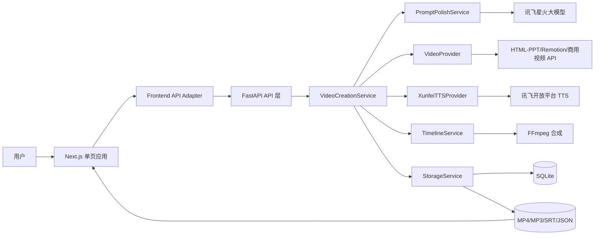
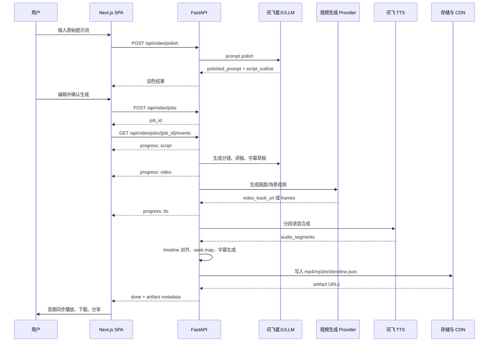

# SparkLearn 前端视频创作与语音播报系统开发文档

> 版本：v1.0.0 · 2026-05-07  
> 文档状态：可开发基线  
> 适用范围：`/generate` 视频创作入口、`/video` 视频播放入口、后端视频编排与讯飞 TTS 中间层  
> 对齐文档：  
> - `Dorc/Frontend-Design-Doc.md`  
> - `Dorc/后端设计文档.md`  
> - `Dorc/学而思｜技术产品方案 V3-多智能体落地版.md`  
> - `Dorc/讯飞SDK使用说明文档.md`  
> - `Dorc/讯飞星火SDK对接说明（无敏感信息）.md`

---

## 1. 文档目的

本文档用于设计并落实 SparkLearn 的前端视频创作与语音播报系统，目标是形成一条可演示、可联调、可扩展的视频资源生产链路：

用户输入原始提示词 -> 大模型润色与结构化脚本 -> 视频生成服务生成画面 -> 讯飞开放平台语音合成生成配音 -> 前端音画同步播放 -> 下载与分享。

本文档同时整合现有开发文档中的工程规范，作为后续实现、联调、测试和上线的统一依据。

---

## 2. 项目背景与业务价值

### 2.1 背景

SparkLearn 已具备多 Agent 协作、资源生成、流式输出、学习画像和视频播放页基础结构。当前资源生成链路可以输出文档、PPT、思维导图、练习题等内容，但视频资源仍停留在占位播放或后端预留阶段。

赛题与项目方案均强调多模态学习资源、讯飞生态能力接入和可交付链路。视频创作系统将“讲解内容、画面、配音、字幕、时间轴”统一为一个标准资源类型，使学习者获得更接近真实教学视频的个性化内容。

### 2.2 业务价值

| 价值点 | 说明 |
|--------|------|
| 个性化讲解 | 根据学生画像、薄弱点、学习目标生成不同难度和节奏的视频脚本。 |
| 多模态学习 | 将文本、动画、语音、字幕组合，降低抽象知识理解门槛。 |
| 资源复用 | 视频作为 `resource.type=video` 纳入资源中心，可收藏、回放、下载和分享。 |
| 赛题展示 | 展示“AI 生成内容 + 讯飞语音 + 前端交互 + 可观测日志”的完整闭环。 |
| 可扩展性 | 视频画面生成方案可替换为 HTML-PPT、Remotion、商用视频 API 或开源模型。 |

---

## 3. 现有文档规范提取与统一格式

### 3.1 已检索文档

| 文档 | 可复用规范 |
|------|------------|
| `README.md` | 项目简介、技术栈表格、项目结构、页面清单、快速启动、参考文档。 |
| `Dorc/Frontend-Design-Doc.md` | 前端目录结构、API 层唯一类型源、Mock/Real 切换、流式模式、错误状态。 |
| `Dorc/后端设计文档.md` | API -> Service -> Agent/Provider -> Storage 分层、统一配置、状态码、SSE envelope。 |
| `Dorc/讯飞星火SDK对接说明（无敏感信息）.md` | 讯飞 SDK 接入边界、回调映射、流式事件、敏感信息不入文档。 |
| `Dorc/学而思｜技术产品方案 V3-多智能体落地版.md` | 视频链路产物清单、分段与时间轴、执行日志、资源元数据。 |
| `Dorc/资源链接预览与PDF导出技术标准.md` | 下载入口、响应头、可观测日志、迁移 Checklist。 |
| `frontend/AGENTS.md` | Next.js 版本需要以本地文档和实际依赖为准。 |

### 3.2 统一文档格式

本文档采用以下格式：

1. 一级章节使用 `## n. 标题`。
2. 设计约束使用表格表达。
3. 接口契约使用“方法 + 路径 + 请求体 + 响应体 + 错误码”模板。
4. 流式接口统一使用 SSE envelope。
5. 上线、测试、验收使用 Checklist。
6. 所有密钥以环境变量占位，不写入真实值。

### 3.3 工程规范整合

| 类别 | 统一规范 |
|------|----------|
| 代码风格 | 前端 TypeScript + React Hooks + 原生 `fetch` 封装；后端 FastAPI + Pydantic；单文件超过 200 行优先拆分。 |
| 目录组织 | 前端按功能分目录；API 类型集中在 `frontend/src/lib/api/types.ts`；后端 API 层只调用 Service 层。 |
| 分支命名 | `feature/video-creator`、`fix/video-sync`、`docs/video-tts`、`chore/video-ci`。 |
| 提交信息 | 采用 `type(scope): summary`，示例：`feat(video): add tts timeline orchestration`。 |
| API 文档模板 | 每个接口必须列出请求字段、响应字段、状态码、业务错误码、超时、重试策略。 |
| 版本号规则 | 文档和应用使用 SemVer：`MAJOR.MINOR.PATCH`；前端当前 `0.1.0`，本功能文档基线 `v1.0.0`。 |
| LICENSE 声明 | 当前仓库根 README 未声明项目 LICENSE；新增第三方方案必须记录名称、来源、用途和协议。`frontend/backend-node` 当前 package 为 `ISC`，不可推断为全仓库协议。 |
| README 模板 | 保持“项目简介 -> 技术栈 -> 项目结构 -> 页面清单 -> 快速启动 -> 参考文档”。视频能力上线后补充 `/video` 与 `/generate?type=video` 说明。 |

---

## 4. 系统目标与范围

### 4.1 系统目标

1. 用户在单页应用内输入原始提示词。
2. 前端调用后端大模型润色接口，生成可用于视频创作的结构化提示词。
3. 前端展示润色结果，用户可编辑确认。
4. 后端调用视频生成服务，生成视频画面或 HTML-PPT 场景。
5. 后端调用讯飞开放平台 TTS，生成高质量语音配音。
6. 后端生成字幕与时间轴，返回视频、音频、字幕、分段元数据。
7. 前端使用 `<video>` 与 Web Audio API 实现音画同步播放。
8. 用户可下载 MP4、音频、字幕包，或生成分享链接。

### 4.2 范围边界

| 范围 | 本期策略 |
|------|----------|
| 前端页面 | 在 `/generate` 增加视频创作模式，在 `/video` 增强播放和分享。 |
| 大模型 | 默认使用讯飞星火 Spark Max 或当前后端 LLM Provider。 |
| 视频生成 | 首选 HTML-PPT + Playwright 截帧 + FFmpeg/Remotion 合成；保留商用 API Provider。 |
| 语音合成 | 使用讯飞 TTS WebSocket 接口，后端签名鉴权，前端不接触密钥。 |
| 下载分享 | 下载走后端文件流；分享链接走资源 ID + 短链或带签名 URL。 |
| 真实密钥 | 不进入前端、不进入文档、不进入 Git。 |

---

## 5. 技术选型与版本锁定

以当前仓库实际依赖为实施基线。历史文档中出现的 Next.js 14 / React 18 作为早期设计记录，不作为本功能版本锁定依据。

### 5.1 前端

| 项 | 版本 | 来源 |
|----|------|------|
| Node.js | `20.19.5` | 本地运行环境 |
| npm | `10.8.2` | 本地运行环境 |
| Next.js | `16.2.4` | `frontend/package.json` |
| React | `19.2.4` | `frontend/package.json` |
| React DOM | `19.2.4` | `frontend/package.json` |
| TypeScript | `^5` | `frontend/package.json` |
| Tailwind CSS | `^4` | `frontend/package.json` |
| Lucide React | `^1.11.0` | `frontend/package.json` |
| Zustand | `^5.0.12` | 当前已存在依赖；页面级状态优先，不强制引入全局状态。 |
| Playwright Test | `^1.59.1` | 前端 E2E |

### 5.2 后端

| 项 | 版本 | 用途 |
|----|------|------|
| Python | `3.11.3` | 本地运行环境 |
| FastAPI | `0.115.0` | API 服务 |
| Uvicorn | `0.30.0` | ASGI 服务 |
| Pydantic | `2.9.0` | 请求/响应模型 |
| pydantic-settings | `2.5.2` | 环境变量读取 |
| httpx | `0.27.0` | HTTP Provider |
| Playwright Python | `1.51.0` | HTML 渲染、PDF/画面捕获 |
| FFmpeg | 外部二进制锁定 | 视频、音频、字幕合成；部署时固定镜像或安装包版本。 |

### 5.3 第三方服务

| 服务 | 方案 | 版本或接口 |
|------|------|------------|
| 大模型润色 | 讯飞星火 Spark SDK / WebSocket API | 本地 SDK 基线：`Spark1.5 Windows SDK v1.1`；模型默认 `generalv3.5` 或 `4.0Ultra`。 |
| 语音合成 | 讯飞开放平台在线语音合成 TTS | WebSocket：`wss://tts-api.xfyun.cn/v2/tts`；后端动态签名。 |
| 视频生成 | HTML-PPT + Playwright + FFmpeg；可替换 Remotion 或商用视频 API | Provider 化封装：`html_ppt`、`remotion`、`commercial_api`。 |
| 存储 | SQLite + JSON/JSONL + 静态文件目录 | 资源元数据入库，产物写入 `data/artifacts/video/{resource_id}/`。 |

---

## 6. 总体架构

### 6.1 分层架构图



### 6.2 前后端与第三方服务时序



### 6.3 后端模块边界

```
backend/app/
├── routes/
│   └── video.py                  # API 路由，只调用 service
├── schemas/
│   └── video.py                  # Pydantic 请求/响应模型
├── services/
│   ├── video_creation_service.py # 编排：润色、视频、TTS、合成、落库
│   ├── timeline_service.py       # 分段时间轴与字幕
│   └── artifact_service.py       # 文件存储、下载、分享签名
├── providers/
│   ├── xunfei_tts.py             # 讯飞 TTS 鉴权与 WebSocket 调用
│   ├── video_html_ppt.py         # HTML-PPT 渲染 Provider
│   └── video_commercial.py       # 商用视频 API Provider
└── storage/
    └── video_repo.py             # SQLite + JSON/JSONL 元数据
```

### 6.4 前端模块边界

```
frontend/src/
├── app/(shell)/
│   ├── generate/page.tsx          # 增加 video 模式入口
│   └── video/page.tsx             # 播放、下载、分享、历史视频
├── components/video/
│   ├── VideoCreator.tsx           # 输入、润色、确认生成
│   ├── PolishResultPanel.tsx      # 润色结果展示和编辑
│   ├── VideoPreview.tsx           # video + audio 同步预览
│   ├── VoiceControlBar.tsx        # 播放、暂停、音量、倍速、声线
│   ├── TimelinePanel.tsx          # 分段、字幕、进度
│   └── ShareDialog.tsx            # 分享链接、复制、二维码占位
└── lib/
    ├── api/video.ts               # video API adapter
    ├── api/types.ts               # Video 类型唯一真相源
    └── hooks/useAudioVideoSync.ts # 音画同步 hook
```

---

## 7. 讯飞开放平台 TTS 接入流程

### 7.1 应用与凭证申请

1. 登录讯飞开放平台控制台。
2. 创建应用并开通“在线语音合成”能力。
3. 在应用详情中获取：
   - `APPID`
   - `APIKey`
   - `APISecret`
4. 在后端 `.env` 中配置，不写入前端：

```env
XF_TTS_APP_ID=
XF_TTS_API_KEY=
XF_TTS_API_SECRET=
XF_TTS_BASE_URL=wss://tts-api.xfyun.cn/v2/tts
XF_TTS_DEFAULT_VOICE=xiaoyan
XF_TTS_MAX_CONCURRENCY=2
XF_TTS_TIMEOUT_MS=15000
XF_TTS_TEXT_LIMIT=1000
```

### 7.2 签名算法

讯飞 WebSocket 鉴权采用短时签名 URL。后端每次请求动态生成授权 URL，前端不得参与签名。

请求基线：

```text
host: tts-api.xfyun.cn
date: RFC1123 GMT 时间
request-line: GET /v2/tts HTTP/1.1
```

签名步骤：

1. 生成 `signature_origin`：

```text
host: tts-api.xfyun.cn
date: Thu, 07 May 2026 04:00:00 GMT
GET /v2/tts HTTP/1.1
```

2. 使用 `APISecret` 对 `signature_origin` 做 `HMAC-SHA256`。
3. 对签名结果做 Base64。
4. 生成 authorization 原文：

```text
api_key="$APIKey", algorithm="hmac-sha256", headers="host date request-line", signature="$signature"
```

5. 对 authorization 原文 Base64。
6. 将 `authorization`、`date`、`host` 作为 query 拼接到 WebSocket URL。

伪代码：

```python
def build_tts_auth_url(base_url: str, api_key: str, api_secret: str) -> str:
    host = "tts-api.xfyun.cn"
    path = "/v2/tts"
    date = formatdate(timeval=None, localtime=False, usegmt=True)
    origin = f"host: {host}\ndate: {date}\nGET {path} HTTP/1.1"
    digest = hmac.new(api_secret.encode(), origin.encode(), hashlib.sha256).digest()
    signature = base64.b64encode(digest).decode()
    auth = (
        f'api_key="{api_key}", algorithm="hmac-sha256", '
        f'headers="host date request-line", signature="{signature}"'
    )
    query = urlencode({
        "authorization": base64.b64encode(auth.encode()).decode(),
        "date": date,
        "host": host,
    })
    return f"{base_url}?{query}"
```

### 7.3 合成请求参数

```json
{
  "common": {
    "app_id": "$XF_TTS_APP_ID"
  },
  "business": {
    "aue": "lame",
    "auf": "audio/L16;rate=16000",
    "vcn": "xiaoyan",
    "tte": "utf8",
    "speed": 50,
    "volume": 50,
    "pitch": 50
  },
  "data": {
    "status": 2,
    "text": "base64(UTF-8 text)"
  }
}
```

### 7.4 token 刷新机制

当前 WebSocket TTS 采用“每次请求动态签名 URL”，不是长期 access token 模式。因此刷新策略为：

1. 每个 TTS 分段请求创建新的签名 URL。
2. 签名 URL 仅在后端内存中使用，不落库。
3. 签名 URL TTL 按 240 秒控制，超过 TTL 丢弃并重新签名。
4. WebSocket 已建立后不刷新 token；连接失败或鉴权过期时重新签名并重试。
5. 若未来切换到 access token 型 Provider，在 token 过期时间的 80% 处刷新，并使用分布式锁避免并发刷新风暴。

### 7.5 配额与并发限制

讯飞账号的实际配额、QPS、并发数以开放平台控制台和合同为准，不能硬编码在前端。系统按以下方式实现可配置保护：

| 项 | 默认值 | 说明 |
|----|--------|------|
| `XF_TTS_MAX_CONCURRENCY` | `2` | 单实例并发合成数。 |
| `XF_TTS_TEXT_LIMIT` | `1000` | 单段文本上限，超出按句号、逗号、换行分段。 |
| `XF_TTS_RETRY_COUNT` | `2` | 仅对网络错误、连接断开、5xx 重试。 |
| `XF_TTS_RETRY_BACKOFF_MS` | `500, 1000` | 指数退避，避免触发限流。 |
| `XF_TTS_RATE_LIMIT_WINDOW` | `60s` | 统计每分钟请求数，超过阈值排队。 |

---

## 8. 前端页面线框图与交互流程

### 8.1 单页布局线框图

```text
┌────────────────────────────────────────────────────────────────────┐
│ SparkLearn / 视频创作                                                │
├───────────────────────────────┬────────────────────────────────────┤
│ 原始提示词输入区                 │ 视频预览区                           │
│ ┌───────────────────────────┐ │ ┌────────────────────────────────┐ │
│ │ 输入要讲解的知识点、对象、风格 │ │ │ <video> 画面预览                 │ │
│ │ 例如：用动画讲清 Python 变量  │ │ │ 字幕叠层 + 缓冲状态 + 错误状态      │ │
│ └───────────────────────────┘ │ └────────────────────────────────┘ │
│ [润色提示词] [生成视频]          │ 语音播报控制条                        │
│                               │ [播放] [进度] [音量] [倍速] [声线]       │
├───────────────────────────────┼────────────────────────────────────┤
│ 润色结果展示区                   │ 时间轴 / 分段区                         │
│ ┌───────────────────────────┐ │ 00:00 片头                            │
│ │ 结构化脚本、分镜、讲稿、字幕草稿 │ │ 00:12 讲解变量                         │
│ └───────────────────────────┘ │ 00:38 代码演示                         │
│ [应用修改] [重新润色]             │ [下载 MP4] [下载音频] [下载字幕] [分享]   │
└───────────────────────────────┴────────────────────────────────────┘
```

### 8.2 交互流程

1. 用户进入 `/generate` 并选择“视频讲解”。
2. 输入原始提示词、目标年级、讲解风格、视频时长、声线。
3. 点击“润色提示词”。
4. 前端显示结构化润色结果，包括标题、讲稿大纲、分镜、字幕草稿。
5. 用户可编辑润色结果。
6. 点击“生成视频”。
7. 前端订阅生成事件，展示阶段进度：
   - `polishing`
   - `scripting`
   - `video_rendering`
   - `tts_synthesizing`
   - `muxing`
   - `completed`
8. 生成完成后自动载入预览区。
9. 用户播放、暂停、seek、切换倍速和音量。
10. 用户下载 MP4、音频、字幕，或复制分享链接。

### 8.3 页面状态

| 状态 | 前端表现 | 可操作项 |
|------|----------|----------|
| `idle` | 输入表单可编辑 | 润色 |
| `polishing` | 按钮 loading，展示流式润色片段 | 取消 |
| `polished` | 展示润色结果 | 编辑、重新润色、生成 |
| `generating` | 阶段进度、日志抽屉 | 取消、查看日志 |
| `ready` | 视频预览、控制条、下载分享 | 播放、下载、分享 |
| `failed` | 友好错误态、保留输入 | 重试、复制错误 ID |

---

## 9. 接口契约

### 9.1 统一响应格式

非流式接口统一使用：

```json
{
  "success": true,
  "data": {},
  "error": null,
  "request_id": "req_20260507_xxxx"
}
```

失败响应：

```json
{
  "success": false,
  "data": null,
  "error": {
    "code": "VIDEO_TTS_QUOTA_EXCEEDED",
    "message": "语音合成服务暂时繁忙，请稍后重试",
    "retryable": true
  },
  "request_id": "req_20260507_xxxx"
}
```

流式接口统一使用 SSE envelope：

```text
data: {"type":"progress","payload":{"stage":"tts_synthesizing","progress":72}}

data: {"type":"done","payload":{"resource_id":"video_001"}}
```

### 9.2 `POST /api/video/polish`

用途：将原始提示词润色为视频生成可用的结构化脚本。

请求体：

```json
{
  "prompt": "用动画讲清 Python 变量",
  "course_id": "python_basic",
  "user_id": "single_user",
  "target_level": "beginner",
  "duration_sec": 90,
  "style": "生动但不幼稚",
  "voice": "xiaoyan"
}
```

响应体：

```json
{
  "success": true,
  "data": {
    "polish_id": "polish_001",
    "title": "Python 变量：给数据贴上清晰标签",
    "polished_prompt": "生成一个 90 秒讲解视频...",
    "script_outline": [
      {
        "segment_id": "seg_001",
        "title": "变量是什么",
        "narration": "变量可以理解为数据的名字...",
        "visual_hint": "用标签贴到盒子上的动画表达"
      }
    ],
    "estimated_duration_sec": 90
  },
  "error": null,
  "request_id": "req_xxx"
}
```

超时：`8000ms`。  
重试：网络错误可重试 1 次；LLM 内容安全错误不重试。  

### 9.3 `POST /api/video/jobs`

用途：创建视频生成任务。

请求体：

```json
{
  "polish_id": "polish_001",
  "prompt": "生成一个 90 秒讲解视频...",
  "script_outline": [],
  "video_provider": "html_ppt",
  "voice": {
    "vcn": "xiaoyan",
    "speed": 50,
    "volume": 55,
    "pitch": 50
  },
  "output": {
    "resolution": "1920x1080",
    "fps": 30,
    "format": "mp4"
  }
}
```

响应体：

```json
{
  "success": true,
  "data": {
    "job_id": "job_001",
    "resource_id": "video_001",
    "status": "queued",
    "events_url": "/api/video/jobs/job_001/events"
  },
  "error": null,
  "request_id": "req_xxx"
}
```

超时：`3000ms`，仅创建任务，不阻塞等待生成完成。  

### 9.4 `GET /api/video/jobs/{job_id}/events`

用途：订阅视频生成进度。

事件类型：

| type | payload |
|------|---------|
| `progress` | `{ "stage": "tts_synthesizing", "progress": 72, "message": "正在生成第 4 段配音" }` |
| `artifact` | `{ "kind": "audio_segment", "segment_id": "seg_004", "url": "/artifacts/..." }` |
| `meta` | `{ "trace_id": "trace_001", "cost_ms": 1200 }` |
| `error` | `{ "code": "VIDEO_PROVIDER_FAILED", "message": "视频画面生成失败", "retryable": true }` |
| `done` | `{ "resource_id": "video_001" }` |

超时：服务端任务超时 `180000ms`；SSE 心跳间隔 `15000ms`。  
重试：前端 SSE 断开后按 `Last-Event-ID` 或 `job_id` 重连，最多 3 次。

### 9.5 `GET /api/video/resources/{resource_id}`

用途：查询视频资源详情。

响应体：

```json
{
  "success": true,
  "data": {
    "id": "video_001",
    "title": "Python 变量：给数据贴上清晰标签",
    "status": "completed",
    "video_url": "/api/video/resources/video_001/download/mp4",
    "audio_url": "/api/video/resources/video_001/download/audio",
    "subtitle_url": "/api/video/resources/video_001/download/srt",
    "share_url": "/share/video/video_001?token=...",
    "duration_ms": 90240,
    "resolution": "1920x1080",
    "fps": 30,
    "timeline": [
      {
        "segment_id": "seg_001",
        "start_ms": 0,
        "end_ms": 12400,
        "subtitle": "变量可以理解为数据的名字..."
      }
    ],
    "created_at": "2026-05-07T12:00:00+08:00"
  },
  "error": null,
  "request_id": "req_xxx"
}
```

### 9.6 下载与分享接口

| 方法 | 路径 | 说明 |
|------|------|------|
| `GET` | `/api/video/resources/{id}/download/mp4` | 下载 MP4，`Content-Type: video/mp4`。 |
| `GET` | `/api/video/resources/{id}/download/audio` | 下载合成音频，`Content-Type: audio/mpeg`。 |
| `GET` | `/api/video/resources/{id}/download/srt` | 下载字幕，`Content-Type: application/x-subrip`。 |
| `POST` | `/api/video/resources/{id}/share` | 创建带过期时间的分享链接。 |

### 9.7 状态码

| 状态码 | 场景 |
|--------|------|
| `200` | 成功 |
| `201` | 任务创建成功 |
| `400` | 参数错误、脚本为空、时长非法 |
| `401` | 未登录或签名无效 |
| `403` | 无资源访问权限 |
| `404` | 任务或资源不存在 |
| `409` | 重复提交、任务状态冲突 |
| `422` | Pydantic 验证失败 |
| `429` | 配额或并发限制 |
| `500` | 服务端异常 |
| `502` | 第三方服务异常 |
| `504` | 生成超时 |

### 9.8 业务错误码

| 错误码 | 场景 | 重试 |
|--------|------|------|
| `VIDEO_PROMPT_INVALID` | 提示词为空或违反内容安全 | 否 |
| `VIDEO_LLM_FAILED` | 润色或脚本生成失败 | 是 |
| `VIDEO_PROVIDER_FAILED` | 视频 Provider 失败 | 是 |
| `VIDEO_TTS_AUTH_FAILED` | 讯飞 TTS 鉴权失败 | 否，需检查配置 |
| `VIDEO_TTS_QUOTA_EXCEEDED` | TTS 配额或并发超限 | 是，延迟重试 |
| `VIDEO_TTS_SYNTH_FAILED` | 单段语音合成失败 | 是，单段重试 |
| `VIDEO_MUX_FAILED` | 音视频合成失败 | 是 |
| `VIDEO_ARTIFACT_NOT_FOUND` | 产物文件不存在 | 否 |
| `VIDEO_SHARE_EXPIRED` | 分享链接过期 | 否 |

---

## 10. 音画同步策略

### 10.1 同步基准

系统以视频时间戳为主时钟，音频通过 Web Audio API 作为可校正副时钟：

1. `<video>.currentTime` 是主时间。
2. Web Audio `AudioContext.currentTime` 用于计算音频播放偏移。
3. `timeline.json` 记录分段 `start_ms`、`end_ms`、`audio_offset_ms`。
4. 字幕显示由主时钟驱动，不依赖音频事件。

### 10.2 推荐播放模式

本期优先输出带音轨的 MP4。前端直接播放 MP4 时浏览器原生保证基础同步。Web Audio API 用于增强场景：

1. 视频轨和音频轨分离播放。
2. 用户切换配音声线。
3. 需要音量可视化、音频滤镜或精细校正。

### 10.3 对齐算法

```typescript
const DRIFT_THRESHOLD_SEC = 0.08
const HARD_SYNC_THRESHOLD_SEC = 0.35

function syncAudioToVideo(video: HTMLVideoElement, audio: HTMLAudioElement) {
  const drift = audio.currentTime - video.currentTime

  if (Math.abs(drift) > HARD_SYNC_THRESHOLD_SEC) {
    audio.currentTime = video.currentTime
    return
  }

  if (Math.abs(drift) > DRIFT_THRESHOLD_SEC) {
    audio.playbackRate = drift > 0 ? 0.98 : 1.02
    return
  }

  audio.playbackRate = video.playbackRate
}
```

策略说明：

1. 漂移小于 `80ms`：不处理，避免频繁校正带来抖动。
2. 漂移 `80ms - 350ms`：通过音频 `playbackRate` 微调。
3. 漂移大于 `350ms`：硬 seek 到视频时间。
4. 每 `250ms` 检查一次漂移；页面不可见时暂停检查。

### 10.4 缓冲策略

| 场景 | 策略 |
|------|------|
| 视频未达到 `canplay` | 控制条禁用播放，展示缓冲状态。 |
| 音频未达到 `canplaythrough` | 若 MP4 内含音轨，降级只播放 MP4；若分离音频，等待或提示重试。 |
| 网络抖动 | 暂停主时钟，记录 `lastStableTime`，恢复后重新校正。 |
| 移动端自动播放限制 | 首次播放必须由用户点击触发，同时恢复 `AudioContext`。 |

### 10.5 seek 后重新同步逻辑

1. 用户拖动进度条触发 `seeking`。
2. 暂停音频输出，记录目标 `targetTime`。
3. 视频触发 `seeked` 后，将音频 `currentTime` 设置为 `targetTime`。
4. 重新计算当前字幕 segment。
5. 视频和音频都达到可播放状态后恢复播放。
6. 若 2 秒内音频未恢复，则提示“语音缓冲中”，视频可继续静音播放。

### 10.6 字幕对齐

字幕以 `timeline.json` 为唯一来源：

```json
{
  "version": "1.0.0",
  "duration_ms": 90240,
  "segments": [
    {
      "segment_id": "seg_001",
      "start_ms": 0,
      "end_ms": 12400,
      "narration": "变量可以理解为数据的名字",
      "subtitle": "变量可以理解为数据的名字",
      "audio_url": "/artifacts/video_001/audio/seg_001.mp3"
    }
  ]
}
```

---

## 11. 视频生成与产物规范

### 11.1 生成方案

本期默认使用“讲解内容驱动”的 HTML-PPT 方案，对齐 V3 文档：

1. 大模型生成 HTML-PPT 页面结构。
2. 生成分段讲稿。
3. 调用讯飞 TTS 生成分段音频。
4. 基于音频时长生成字幕时间轴。
5. 使用 Playwright 截帧或 Remotion 渲染视频轨。
6. 使用 FFmpeg 合成 MP4。

### 11.2 产物目录

```
data/artifacts/video/{resource_id}/
├── slides.html
├── script.json
├── timeline.json
├── subtitle.srt
├── audio_segments/
│   ├── seg_001.mp3
│   └── seg_002.mp3
├── video_track.mp4
├── output.mp4
└── manifest.json
```

### 11.3 manifest

```json
{
  "resource_id": "video_001",
  "provider": "html_ppt",
  "tts_provider": "xunfei",
  "title": "Python 变量：给数据贴上清晰标签",
  "duration_ms": 90240,
  "resolution": "1920x1080",
  "fps": 30,
  "files": {
    "mp4": "output.mp4",
    "audio": "audio_segments/merged.mp3",
    "subtitle": "subtitle.srt",
    "timeline": "timeline.json"
  },
  "created_at": "2026-05-07T12:00:00+08:00"
}
```

---

## 12. 异常处理与降级方案

### 12.1 网络失败

| 场景 | 处理 |
|------|------|
| 润色请求失败 | 前端保留输入，允许重试；后端记录 `VIDEO_LLM_FAILED`。 |
| SSE 断开 | 前端重连同一 `job_id`，后端从任务状态继续推送。 |
| 下载中断 | 前端重新请求下载 URL；后端支持 Range 请求。 |

### 12.2 讯飞配额超限

1. 后端返回 `429` 和 `VIDEO_TTS_QUOTA_EXCEEDED`。
2. 任务进入 `waiting_retry`。
3. 单段合成进入队列，按退避策略重试。
4. 超过最大等待时间后，降级为“无配音视频 + 字幕”。
5. 前端提示“语音服务繁忙，已为你保留无配音版本”。

### 12.3 视频生成失败

1. 若商用 Provider 失败，切换到 HTML-PPT 静态画面合成。
2. 若单页渲染失败，使用模板兜底页替换该段。
3. 若 FFmpeg 合成失败，保留分段音频、字幕和 HTML 预览。
4. 前端提供“重新生成画面”和“仅下载讲稿/音频”。

### 12.4 语音合成失败

1. 单段失败最多重试 2 次。
2. 重试仍失败时，使用浏览器 `speechSynthesis` 作为本地预览降级，不作为最终下载产物。
3. 生成任务标记 `partial_audio`，并在 manifest 中记录失败 segment。
4. 用户可重试失败段，不需要重跑完整视频。

### 12.5 浏览器兼容

| 能力 | 最低要求 | 降级 |
|------|----------|------|
| `<video>` MP4 | Chrome/Edge/Safari/Firefox 近两年版本 | 提供下载链接 |
| Web Audio API | 主流桌面和移动浏览器 | 使用 MP4 内置音轨 |
| Clipboard API | HTTPS 环境 | 展示可手动复制输入框 |
| Web Share API | 移动端优先 | 复制分享链接 |
| Media Session API | Chrome/Edge/Safari 部分支持 | 不显示系统媒体控制 |

---

## 13. 性能指标

| 指标 | 目标 | 实现策略 |
|------|------|----------|
| 首帧渲染 | `< 800ms` | 首屏只渲染输入区和空预览，历史视频懒加载。 |
| 端到端延迟 | `< 3s` | 指“创建任务后首个可见进度事件”，完整视频生成按任务异步执行。 |
| 视频规格 | `1080p / 30fps` | 输出 `1920x1080`，FFmpeg 固定 fps 30。 |
| 内存占用 | `< 200MB` | 前端不把完整视频读入内存，使用 URL 流式播放。 |
| SSE 首事件 | `< 500ms` | 创建任务后立即返回 `queued`/`progress`。 |
| 音画漂移 | `< 80ms` | 漂移检测 + playbackRate 微调。 |
| 下载响应 | `< 1s` 开始传输 | 文件预生成，下载接口直接返回文件流。 |

---

## 14. 安全规范

### 14.1 HTTPS 强制

1. 生产环境所有页面、API、下载和分享链接必须使用 HTTPS。
2. WebSocket 使用 `wss://`。
3. HTTP 请求在网关层 301 跳转 HTTPS。

### 14.2 CSP

推荐响应头：

```text
Content-Security-Policy:
  default-src 'self';
  script-src 'self';
  style-src 'self' 'unsafe-inline';
  img-src 'self' data: https:;
  media-src 'self' blob: https:;
  connect-src 'self' https: wss:;
  frame-ancestors 'none';
```

### 14.3 接口防重放

1. 前端每次写操作生成 `X-Request-Id`。
2. 后端要求 `X-Timestamp` 与服务端时间差不超过 5 分钟。
3. 登录态下校验 CSRF token 或 SameSite Cookie。
4. 创建任务接口对 `user_id + prompt_hash + 60s` 做幂等保护。
5. 分享链接使用 HMAC 签名和过期时间。

### 14.4 敏感信息环境变量注入

所有第三方凭证仅在后端读取：

```env
SPARK_APP_ID=
SPARK_API_KEY=
SPARK_API_SECRET=
XF_TTS_APP_ID=
XF_TTS_API_KEY=
XF_TTS_API_SECRET=
VIDEO_PROVIDER_API_KEY=
```

前端只允许读取 `NEXT_PUBLIC_*` 且不得包含密钥。

### 14.5 前端代码混淆

1. 生产构建开启 Next.js 默认压缩与 tree-shaking。
2. 不在前端保存算法密钥、Provider token、签名逻辑。
3. sourcemap 只上传到内部错误平台，不公开暴露。
4. 分享页只暴露必要资源元数据。

### 14.6 内容安全

1. 润色结果进入视频生成前做内容审核。
2. HTML-PPT 渲染前进行 HTML sanitization。
3. 外链资源只允许 `http/https`，拒绝 `file:`、`javascript:`。
4. 下载文件名使用安全字符白名单。

---

## 15. 测试用例清单

### 15.1 单元测试

| 模块 | 用例 |
|------|------|
| `build_tts_auth_url` | 签名字段完整、date 格式正确、query 编码正确。 |
| `split_tts_text` | 1000 字符分段、中文标点分割、长句兜底切分。 |
| `timeline_service` | 音频时长累加、字幕 SRT 格式、segment ID 唯一。 |
| `useAudioVideoSync` | drift 小于阈值不校正，大于阈值校正。 |
| `video api adapter` | 字段 snake_case/camelCase 映射正确。 |

### 15.2 接口测试

| 接口 | 用例 |
|------|------|
| `POST /api/video/polish` | 正常润色、空 prompt、超长 prompt、内容安全失败。 |
| `POST /api/video/jobs` | 创建任务、重复创建、非法 provider、非法声线。 |
| `GET /api/video/jobs/{id}/events` | 进度事件、error 事件、done 事件、断线重连。 |
| `GET /api/video/resources/{id}` | 查询成功、不存在、无权限。 |
| 下载接口 | 文件存在、文件缺失、Range 请求、中文文件名。 |

### 15.3 E2E 测试

1. 用户输入 prompt -> 润色 -> 编辑 -> 生成 -> 预览。
2. 生成过程中刷新页面，任务状态可恢复。
3. 视频播放、暂停、seek 后字幕正确。
4. 切换倍速后音画保持同步。
5. 下载 MP4、音频、字幕均成功。
6. 分享链接复制成功，过期链接展示友好错误。

### 15.4 压力测试

| 场景 | 指标 |
|------|------|
| 10 个并发润色请求 | P95 首事件 `< 1s`。 |
| 5 个并发视频任务 | 队列不丢任务，状态可查询。 |
| TTS 配额压测 | 触发排队和 429 降级，不雪崩。 |
| 大文件下载 | 100MB MP4 可稳定下载，支持断点续传。 |

### 15.5 兼容性测试

1. Chrome 最新版。
2. Edge 最新版。
3. Safari 最新版。
4. Firefox 最新版。
5. iOS Safari。
6. Android Chrome。

### 15.6 无障碍测试

1. 所有按钮有可访问名称。
2. 视频控制条支持键盘操作。
3. 字幕默认可打开。
4. 生成进度使用 `aria-live="polite"`。
5. 错误信息可被屏幕阅读器读出。
6. 颜色对比度满足 WCAG AA。

---

## 16. 上线 Checklist

### 16.1 CI/CD

1. 前端执行 `npm run lint`。
2. 前端执行 TypeScript 检查：`npx tsc --noEmit --pretty false`。
3. 后端执行 `pytest`。
4. E2E 执行视频创作主流程。
5. 构建产物记录版本号、commit hash、构建时间。

### 16.2 灰度发布

1. 使用功能开关：`VIDEO_CREATOR_ENABLED=true`。
2. 先开放内部账号。
3. 再开放 10% 用户。
4. 观察 TTS 失败率、视频生成失败率、下载成功率。
5. 指标稳定后全量。

### 16.3 监控告警

| 指标 | 告警阈值 |
|------|----------|
| `video_job_failed_rate` | 5 分钟内 `> 10%` |
| `tts_auth_failed_count` | 5 分钟内 `> 3` |
| `tts_quota_exceeded_count` | 5 分钟内 `> 10` |
| `mux_failed_count` | 5 分钟内 `> 5` |
| `download_5xx_rate` | 5 分钟内 `> 2%` |
| `audio_video_drift_avg_ms` | `> 120ms` |

### 16.4 日志规范

每个任务记录：

```json
{
  "request_id": "req_xxx",
  "job_id": "job_001",
  "resource_id": "video_001",
  "user_id": "single_user",
  "stage": "tts_synthesizing",
  "provider": "xunfei",
  "status": "success",
  "cost_ms": 823,
  "input_summary": "seg_004 length=112",
  "output_summary": "audio_ms=9340",
  "created_at": "2026-05-07T12:00:00+08:00"
}
```

不得记录：

1. APISecret。
2. APIKey 完整值。
3. 签名 URL 完整 query。
4. 用户隐私原文的长期明文日志。

### 16.5 回滚方案

1. 关闭 `VIDEO_CREATOR_ENABLED`。
2. `/generate` 隐藏视频创作入口。
3. `/video` 保留历史视频播放，不允许新建任务。
4. 后端停止消费视频任务队列。
5. 已生成产物保持可下载。
6. 回滚后保留错误日志和任务 manifest 用于排查。

---

## 17. 验收标准

1. 用户能在单页内完成 prompt 输入、润色、确认生成、预览播放。
2. 生成链路至少支持 HTML-PPT + 讯飞 TTS + FFmpeg 合成 MP4。
3. 前端展示润色结果、视频预览、语音控制条、下载按钮、分享入口。
4. 音画同步 seek 后可恢复，平均漂移小于 `80ms`。
5. 讯飞 TTS 密钥只存在后端环境变量。
6. 网络失败、配额超限、视频失败、TTS 失败均有明确降级。
7. 1080p/30fps 视频可播放和下载。
8. 单元、接口、E2E、兼容性、无障碍测试清单均可执行。
9. CI/CD、灰度、监控告警、日志、回滚方案完整。

---

## 18. 后续落地顺序

1. 新增后端 `schemas/video.py`、`routes/video.py`、`services/video_creation_service.py`。
2. 新增 `providers/xunfei_tts.py`，先打通单段 TTS。
3. 新增 `timeline_service.py`，生成 `timeline.json` 和 `subtitle.srt`。
4. 接入 HTML-PPT Provider，输出静态场景视频。
5. 使用 FFmpeg 合成 `output.mp4`。
6. 前端新增 `components/video/*` 和 `lib/hooks/useAudioVideoSync.ts`。
7. 改造 `/generate` 视频模式和 `/video` 播放页。
8. 补齐测试、监控和 README 入口说明。

---

## 19. 自查清单

| 序号 | 检查项 | 结论 |
|------|--------|------|
| 1 | 是否包含项目背景与业务价值 | 已覆盖 |
| 2 | 是否包含系统架构图和时序图 | 已覆盖 |
| 3 | 是否锁定 Node、React、讯飞 SDK、视频方案、大模型接口 | 已覆盖 |
| 4 | 是否说明讯飞 APPID、APISecret、APIKey、签名、token、配额并发 | 已覆盖 |
| 5 | 是否包含前端线框图与交互流程 | 已覆盖 |
| 6 | 是否包含接口契约、状态码、错误码、重试和超时 | 已覆盖 |
| 7 | 是否包含音画同步算法、缓冲和 seek 逻辑 | 已覆盖 |
| 8 | 是否包含异常处理与降级 | 已覆盖 |
| 9 | 是否包含性能指标 | 已覆盖 |
| 10 | 是否包含安全规范 | 已覆盖 |
| 11 | 是否包含测试用例清单 | 已覆盖 |
| 12 | 是否包含上线 checklist | 已覆盖 |
| 13 | 是否整合现有文档规范 | 已覆盖 |

